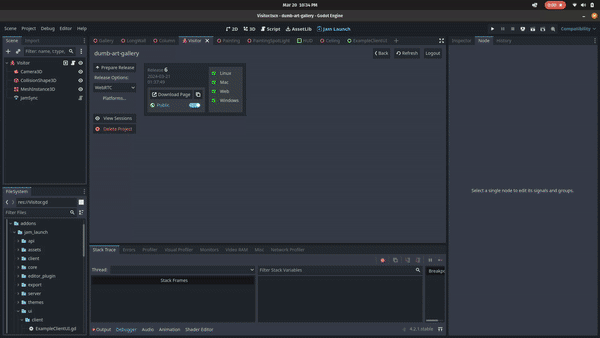

# Dumb Art Gallery

A multiplayer game where you fill a virtual art gallery with images based on
prompts you provide. You can play a deployed version of Dumb Art Gallery
[HERE!](https://app.jamlaunch.com/g/Jk4VyoecDM/6)

## But Why

This project demonstrates a few features of [Jam Launch](https://jamlaunch.com)
including:
- WebRTC peer-to-peer
- Using Jam Launch OpenID to authenticate players with private APIs

It uses a stable diffusion pipeline via the Mystic AI APIs in order to generate
paintings in a gallery with your friends.

This project was made as part of [Backdrop Build v3](https://backdropbuild.com/)
